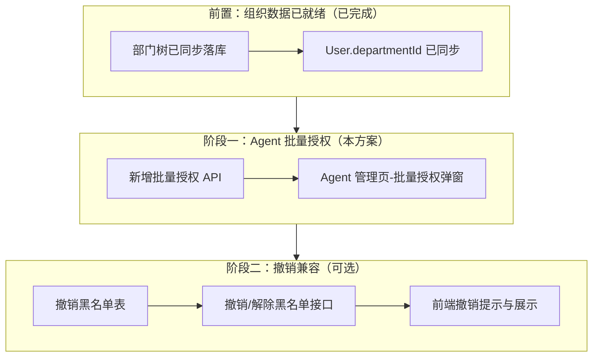

# Agent 管理页：批量授权方案（v1.2）

> **依赖说明（已更新）**：组织架构数据（部门 + 用户归属）已由后端程序实现“全量同步”，并写入本系统数据库（`departments` / `users.department_id`）。  
> 前端可通过现有组织树接口获取树状结构（例如 `GET /api/admin/organization`），本文档不再依赖任何 “MDM 部门同步” 的实现细节。

---

## 1. 背景 / 现状

当前 Agent 授权的主要入口在「用户管理」：

1) 管理员进入「用户管理」  
2) 选中某个用户  
3) 在用户详情里逐个添加 Agent 权限并保存  

对应后端接口是单用户维度：

- `GET/POST/DELETE /api/admin/users/[id]/agents`（维护 `user_agent_permissions` 记录）

### 痛点

当需要把**某一个 Agent**快速授权给：

- 一个部门（部门下成百上千用户）
- 或者一整个公司（你描述的“分公司”场景，本系统等价于一个 `company`/租户）

目前缺少“从 Agent 侧出发”的操作入口，导致：

- 操作路径长：必须逐用户处理
- 人工成本高、易漏配
- 对大量用户/导入用户场景不友好

> 备注：用户管理页目前已有一个“批量授权全部 Agent”的能力：  
> （如果需要）可另行实现 “给一批用户批量授权全部 Agent” 的对称能力。  
> 本方案聚焦在 Agent 管理页提供：**把一个 Agent 批量授权给一批用户**。

---

## 2. 目标（需求解读）

在「Agent 管理」页面提供一个入口，实现：

- 选择一个 Agent
- 选择目标用户范围（部门 / 全公司 / 指定用户），其中**部门范围以本系统已同步的组织结构（部门树）为准**
- 一次性批量授予该 Agent 权限（幂等、可重复执行）
- 保证用户体验：可预览范围、可见进度/结果、失败不破坏现有数据

扩展目标（本次一并实现）：

- **支持单用户撤销权限**：用户管理页可单独撤销某用户的 Agent 权限
- **撤销黑名单机制**：被单独撤销的权限不会被后续批量授权恢复

非目标（可后续扩展）：

- 批量"撤销授权"（按部门批量撤销）
- 跨公司给别的公司用户授权（系统当前租户隔离下通常不允许）

---

## 2.5 与组织架构（部门树）的联动（已更新）

组织架构数据已经由后端全量同步落库，因此 Agent 批量授权在“按部门授权”模式下需要做如下适配：

- **部门来源**：以本系统 `departments` 表为准（关键字段：`id` / `parent_id` / `sort_order` / `is_active`）。
- **树形层级**：树的父子关系以 `parent_id` 为准（当前同步数据中 `parent_sids` 可能为空，不应作为依赖）。
- **树形选择**：部门选择应支持树形层级（部门/子部门），而不是平铺列表。
- **包含子部门**：授权时通常需要“选中部门 → 覆盖其全部子部门用户”，建议作为默认行为，并提供开关。
- **依赖用户归属**：按部门筛选用户依赖 `User.departmentId`；若部分用户未正确归属部门，则会导致授权遗漏（需要在用户导入/同步链路中保证 departmentId 正确）。
- **不回写组织架构**：本方案所有授权行为仅影响本系统的 `user_agent_permissions`，不涉及组织架构回写。

---

## 3. 建议的产品交互（前端）

### 3.1 入口位置（Agent 管理页）

在 `app/admin/agents/page.tsx` 的每个 Agent 行操作区增加按钮：

- `批量授权`（建议与“编辑/删除”并列）

点击后弹出 `Dialog`：

### 3.2 批量授权弹窗（建议字段）

**Step 1：选择范围**

- 授权范围（单选）：
  - `按部门授权`（多选部门，**树形选择**，建议默认“包含子部门”）
  - `按用户授权`（搜索/多选用户，适合小范围）
  - `全公司普通用户`（一键授权给当前公司所有普通用户）

**按部门授权：建议增加一个开关**

- `包含子部门`：默认开启
  - 开启：选中部门后，目标用户 = 该部门 + 全部子部门下的用户
  - 关闭：仅该部门直属用户（不含子部门）

**Step 2：过滤条件（可选）**

- 是否包含管理员（默认不包含）
- 是否包含停用用户（默认包含/可配置）

**Step 3：预览与确认（强烈建议）**

- 展示匹配到的用户数量 `usersMatched`
- 展示“预计新增权限数” `willInsert`（= usersMatched - alreadyHasCount，估算/或精确计算）
- 展示少量示例用户（可选，防止误操作）

**提交**

- 点击「确认授权」后触发批量接口
- UI 显示 loading（并允许关闭弹窗但不终止任务：可选）
- 返回后展示结果：`usersProcessed / inserted / skipped`

### 3.3 用户体验约束

- **幂等**：重复点击不会重复插入（`skipDuplicates`）
- **失败不破坏**：失败时仅提示错误，不回滚已存在权限
- **大批量提示**：当用户量很大时（例如 > 5000），提示“预计需要几十秒”

---

## 4. 后端接口建议（核心）

### 4.1 新增 API：按 Agent 批量授予用户权限

建议新增：

`POST /api/admin/agents/[id]/bulk/grant-users`

请求体（建议 zod 校验）：

```json
{
  "mode": "company" | "departments" | "users",
  "departmentIds": ["..."],   // mode=departments
  "includeSubDepartments": true, // mode=departments，默认 true
  "userIds": ["..."],         // mode=users
  "includeAdmins": false,
  "includeInactive": true,
  "dryRun": false
}
```

响应体：

```json
{
  "data": {
    "usersMatched": 1234,
    "usersProcessed": 1234,
    "inserted": 1200,
    "skipped": 34
  },
  "message": "批量授权完成"
}
```

实现要点：

- `withAdminAuth` 鉴权（复用现有 admin API 约束）
- 校验 Agent 属于当前公司：`agent.companyId === admin.companyId`
- 根据 `mode` 计算目标用户集合：
  - `company`：当前公司普通用户（可复用 `grant-all-agents` 的筛选逻辑）
  - `departments`：
    - 先基于 `departmentIds` 扩展出目标部门集合（若 `includeSubDepartments=true` 则包含所有子部门）
    - 再用 `user.departmentId in (targetDepartmentIds)` + 过滤条件筛选用户
  - `users`：`id in (...)` + 校验这些用户属于当前公司
- 写入：
  - `prisma.userAgentPermission.createMany({ data, skipDuplicates: true })`
  - 使用分批写入（参考 `grant-all-agents`：控制每批 rows 数，避免 SQL 参数过多）
- `grantedBy` 写入 admin 的 `userId`
- 返回统计：
  - `usersMatched`（匹配到的用户总数）
  - `inserted`（createMany 返回 count）
  - `skipped = usersMatched - inserted`（近似；若分批/并发会有轻微偏差但可接受）

### 4.2 dryRun（推荐）

同一个接口支持 `dryRun=true`：

- 只计算 `usersMatched`、`alreadyHasCount`（可用 `count` 查询）
- 不写入 DB
- 前端用于“预览与确认”

---

## 5. 数据与性能建议（可选但强烈推荐）

### 5.1 Agent 列表 API 不要返回所有 userPermissions 明细

当前 `GET /api/admin/agents` 会 `include userPermissions`（每个 Agent 带一串用户），当用户量大时会明显拖慢：

- 建议改为仅返回 `_count.userPermissions`（只要数量即可）
- 如需查看授权用户列表，提供一个分页接口：
  - `GET /api/admin/agents/[id]/permissions?cursor=&limit=`

这样能让“Agent 管理页”稳定支持成千上万用户的权限规模。

### 5.2 权限写入的吞吐与超时

- `createMany + skipDuplicates` 在 Postgres 上对批量插入友好
- 仍需做批量分块（例如每次最多 8000 行），避免参数/包大小限制
- 前端需提示“可能耗时”，并对请求超时做友好错误展示

### 5.3 子部门展开（includeSubDepartments）实现（已更新）

部门树已落库（`parent_id`），在“按部门授权”时，需要把选中部门扩展为“自身 + 所有后代部门”。  
对单公司 1k～5k 级别部门量，推荐用 **内存构图 + BFS/DFS**，简单、可控且避免复杂 SQL 递归：

```ts
/**
 * 展开选中部门：返回 (selected + descendants) 的 departmentIds
 * 适用场景：单公司部门量在几千级别以内（当前数据 1600+）
 */
async function expandDepartmentsWithDescendants(companyId: string, selectedIds: string[]) {
  const departments = await prisma.department.findMany({
    where: { companyId },
    select: { id: true, parentId: true },
  })

  const childrenByParent = new Map<string | null, string[]>()
  for (const dept of departments) {
    const key = dept.parentId ?? null
    const list = childrenByParent.get(key) ?? []
    list.push(dept.id)
    childrenByParent.set(key, list)
  }

  const result = new Set<string>()
  const queue = [...selectedIds]
  while (queue.length) {
    const id = queue.pop()!
    if (result.has(id)) continue
    result.add(id)
    const children = childrenByParent.get(id) ?? []
    for (const childId of children) queue.push(childId)
  }

  return Array.from(result)
}
```

**索引建议**（用于后续用户筛选 & 部门读取）：

```sql
-- 部门父子关系查询
CREATE INDEX IF NOT EXISTS idx_department_company_parent ON departments (company_id, parent_id);
-- 用户按部门筛选
CREATE INDEX IF NOT EXISTS idx_users_department_id ON users (department_id);
```

**部门树获取建议（给“部门树选择器”用）**：
- 若已有轻量部门树接口：优先使用（只返回 `id/name/parentId/sortOrder/isActive`）。
- 若只有组织树接口（例如 `GET /api/admin/organization`）：注意它可能携带用户数组，建议在批量授权弹窗中不要一次性拉全量用户数据（只需要部门树即可）。

---

## 6. 安全与权限边界

- 管理员只能对 **当前公司(companyId)** 的用户与 Agent 做授权
- 保护超级管理员账号（如已有 hard-code id），避免误授权/误操作（可复用现有批量接口的保护逻辑）
- 所有写操作记录 `grantedBy`，便于审计

---

## 7. 实施步骤（等待批准后再做）

1) 后端：新增 `POST /api/admin/agents/[id]/bulk/grant-users`（含 dryRun）
2) 前端：`app/admin/agents/page.tsx` 增加“批量授权”按钮 + Dialog
3) 前端：Dialog 内实现“预览(dryRun) → 确认授权 → 展示结果”
4) （可选）Agent 列表改为返回权限数量 `_count`，并提供分页查看授权用户

---

## 8. 撤销权限兼容性设计（重要）

### 8.1 问题场景

批量授权后，管理员在"用户管理"页单独撤销了某用户的 Agent 权限。之后，再次运行批量授权（按部门），会不会把这个用户的权限恢复？

**期望行为**：被单独撤销的权限不应被批量授权自动恢复。

### 8.2 解决方案：撤销黑名单机制

引入 `UserAgentPermissionRevocation` 表，记录被显式撤销的权限组合。批量授权时，自动排除黑名单中的用户-Agent 组合。

**新增 Prisma 模型**：

```prisma
model UserAgentPermissionRevocation {
  id        String   @id @default(cuid())
  userId    String   @map("user_id")
  agentId   String   @map("agent_id")
  
  // 撤销信息
  revokedBy String   @map("revoked_by")       // 撤销操作人
  revokedAt DateTime @default(now()) @map("revoked_at")
  reason    String?                           // 撤销原因（可选）
  
  // 是否仍然生效（管理员可以"解除黑名单"恢复授权）
  isActive  Boolean  @default(true) @map("is_active")
  
  // 过期时间（可选，用于临时撤销场景）
  expiresAt DateTime? @map("expires_at")
  
  user      User     @relation(fields: [userId], references: [id], onDelete: Cascade)
  agent     Agent    @relation(fields: [agentId], references: [id], onDelete: Cascade)
  
  @@unique([userId, agentId], name: "unique_user_agent_revocation")
  @@index([agentId, isActive])
  @@map("user_agent_permission_revocations")
}
```

### 8.3 撤销权限的实现逻辑

**用户管理页 - 撤销单个用户的 Agent 权限**：

```typescript
// DELETE /api/admin/users/[userId]/agents/[agentId]
async function revokeUserAgentPermission(
  userId: string,
  agentId: string,
  revokedBy: string,
  reason?: string
) {
  await prisma.$transaction([
    // 1. 删除权限记录
    prisma.userAgentPermission.delete({
      where: { unique_user_agent: { userId, agentId } }
    }),
    
    // 2. 创建/更新撤销记录（黑名单）
    prisma.userAgentPermissionRevocation.upsert({
      where: { unique_user_agent_revocation: { userId, agentId } },
      create: {
        userId,
        agentId,
        revokedBy,
        reason,
        isActive: true,
      },
      update: {
        revokedBy,
        revokedAt: new Date(),
        reason,
        isActive: true,
        expiresAt: null,  // 清除过期时间
      }
    })
  ]);
}
```

### 8.4 批量授权的实现逻辑（跳过黑名单）

```typescript
// POST /api/admin/agents/[id]/bulk/grant-users
async function bulkGrantAgentPermission(
  agentId: string,
  userIds: string[],
  grantedBy: string,
  options: { skipRevoked?: boolean } = { skipRevoked: true }  // 默认跳过被撤销的
) {
  let eligibleUserIds = userIds;
  let skippedDueToRevocation = 0;
  
  // 1. 查询撤销黑名单（默认启用）
  if (options.skipRevoked !== false) {
    const revocations = await prisma.userAgentPermissionRevocation.findMany({
      where: {
        agentId,
        userId: { in: userIds },
        isActive: true,
        OR: [
          { expiresAt: null },                    // 无过期时间
          { expiresAt: { gt: new Date() } }       // 未过期
        ]
      },
      select: { userId: true }
    });
    
    const revokedUserIds = new Set(revocations.map(r => r.userId));
    skippedDueToRevocation = revokedUserIds.size;
    
    // 2. 过滤掉被撤销的用户
    eligibleUserIds = userIds.filter(id => !revokedUserIds.has(id));
  }
  
  // 3. 批量授权（分批写入）
  const maxRowsPerBatch = 8000;
  const batches = chunkArray(eligibleUserIds, maxRowsPerBatch);
  
  let inserted = 0;
  for (const batch of batches) {
    const rows = batch.map(userId => ({
      userId,
      agentId,
      grantedBy,
      grantedVia: 'bulk',  // 标记授权来源
    }));
    
    const result = await prisma.userAgentPermission.createMany({
      data: rows,
      skipDuplicates: true,
    });
    inserted += result.count;
  }
  
  return {
    usersMatched: userIds.length,
    usersSkippedDueToRevocation: skippedDueToRevocation,
    usersProcessed: eligibleUserIds.length,
    inserted,
    skipped: eligibleUserIds.length - inserted,  // 已有权限的
  };
}
```

### 8.5 解除黑名单（恢复授权能力）

如果管理员确实希望恢复某用户的权限，需要先"解除黑名单"：

```typescript
// POST /api/admin/users/[userId]/agents/[agentId]/unblock
async function unblockUserAgentPermission(userId: string, agentId: string) {
  await prisma.userAgentPermissionRevocation.update({
    where: { unique_user_agent_revocation: { userId, agentId } },
    data: { isActive: false }
  });
  
  // 之后的批量授权将可以正常授予该权限
}
```

### 8.6 前端交互建议

**批量授权弹窗 - 预览信息**：

```
匹配用户数: 100
├─ 已被单独撤销（将跳过）: 3
├─ 已有权限（将跳过）: 12
└─ 实际将授权: 85
```

**可选高级选项**：

- `☐ 忽略撤销黑名单（强制授权所有用户）`
  - 勾选后，即使用户在黑名单中也会被授权
  - 同时清除该用户的撤销记录

**用户管理页 - Agent 权限列表**：

- 显示每个权限的授权来源：`[批量授权]` / `[单独授权]`
- 撤销按钮旁显示提示："撤销后，批量授权将不会恢复此权限"

### 8.7 审计增强（建议）

扩展 `UserAgentPermission` 模型以支持审计：

```prisma
model UserAgentPermission {
  id           String   @id @default(cuid())
  userId       String   @map("user_id")
  agentId      String   @map("agent_id")
  
  // 授权信息
  grantedBy    String   @map("granted_by")
  grantedAt    DateTime @default(now()) @map("granted_at")
  grantedVia   String?  @map("granted_via")      // 'single' | 'bulk_company' | 'bulk_department' | 'bulk_users'
  grantBatchId String?  @map("grant_batch_id")   // 批量操作 ID，方便追溯
  
  agent        Agent    @relation(fields: [agentId], references: [id], onDelete: Cascade)
  user         User     @relation(fields: [userId], references: [id], onDelete: Cascade)
  
  @@unique([userId, agentId], name: "unique_user_agent")
  @@map("user_agent_permissions")
}
```

---

## 9. 实施步骤（含依赖关系）



**具体步骤**：

1. **后端 - 数据模型**
   - 新增 `UserAgentPermissionRevocation` 表（撤销黑名单）
   - 扩展 `UserAgentPermission` 表（审计字段）

2. **后端 - API 实现**
   - `POST /api/admin/agents/[id]/bulk/grant-users`（含 dryRun、跳过黑名单逻辑）
   - `DELETE /api/admin/users/[id]/agents/[agentId]`（撤销并记录黑名单）
   - `POST /api/admin/users/[id]/agents/[agentId]/unblock`（解除黑名单）

3. **前端 - Agent 管理页**
   - "批量授权"按钮 + Dialog
   - Dialog 内实现"预览(dryRun) → 确认授权 → 展示结果"
   - 部门树选择器集成

4. **前端 - 用户管理页**
   - Agent 权限列表显示授权来源
   - 撤销权限时提示"将加入黑名单"
   - （可选）解除黑名单入口

5. **可选优化**
   - Agent 列表改为返回权限数量 `_count`
   - 提供分页查看授权用户

---

## 10. 已确认的业务规则

| 问题 | 已确认答案 |
|------|------------|
| 部门层级深度 | 当前样本数据最大约 8 级（方案按 10-15 级设计） |
| 单次授权最大用户数 | ≤ 5000 人（同步处理即可，无需异步队列） |
| 默认包含子部门 | 是 |
| 支持单独撤销 | 是，且撤销后批量授权不会恢复 |
| 部门来源 | 以本系统数据库为准（由后端全量同步落库） |

---

## 附录：版本历史

| 版本 | 日期 | 变更内容 |
|------|------|----------|
| v1.0 | - | 初始讨论稿 |
| v1.1 | 2026-01-20 | 添加依赖关系、lcode 查询实现、撤销权限兼容性（黑名单机制）、审计增强 |
| v1.2 | 2026-01-28 | 移除 MDM/lcode 依赖，统一以已落库的部门树（parent_id）为准；更新阶段划分与树展开方案 |
