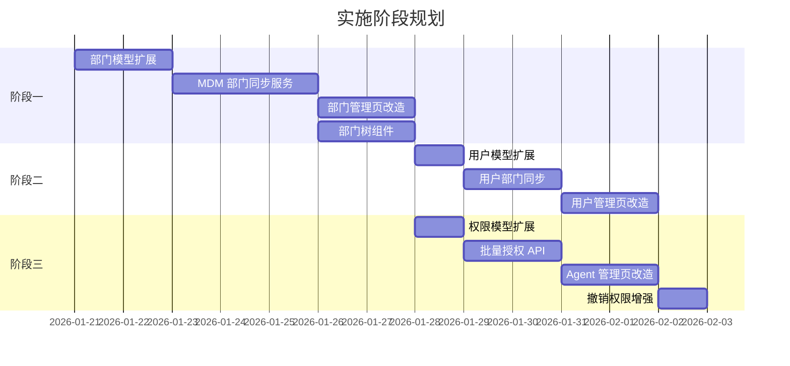

# MDM 部门同步 & Agent 批量授权 - 实施 Checklist

> **文件路径**: `/docs/MDM_AGENT_IMPLEMENTATION_CHECKLIST.md`
> 
> **相关文档**:
> - `/docs/MDM_DEPARTMENT_SYNC_IMPLEMENTATION.md` - MDM 部门同步设计
> - `/docs/AGENT_BULK_AUTHORIZATION_PLAN.md` - Agent 批量授权设计

---

## 实施概览

---

## 阶段一：MDM 部门同步

### 1.1 数据模型扩展

- [ ] **Prisma Schema 更新** (`prisma/schema.prisma`)
  - [ ] 添加 `DepartmentSource` 枚举
  - [ ] 扩展 `Department` 模型：
    - [ ] `parentId` - 父部门 ID（自关联）
    - [ ] `source` - 部门来源（LOCAL/MDM）
    - [ ] `mdmExternalId` - MDM 部门唯一标识
    - [ ] `mdmParentExternalId` - MDM 父部门标识
    - [ ] `mdmCode` - 主数据编码
    - [ ] `mdmLcode` - 长编码（路径）
    - [ ] `mdmLname` - 长名称（路径）
    - [ ] `mdmIdx` - MDM 排序号
    - [ ] `mdmIsUsed` - MDM 是否启用
    - [ ] `mdmPayload` - MDM 原始数据快照
    - [ ] `mdmSyncedAt` - 最后同步时间
    - [ ] `mdmDeletedAt` - MDM 删除时间
  - [ ] 添加唯一约束：`@@unique([companyId, mdmExternalId])`
  - [ ] 添加索引：`@@index([companyId, parentId])`、`@@index([companyId, mdmLcode])`

- [ ] **数据库迁移**
  - [ ] 创建迁移文件：`npx prisma migrate dev --name add_mdm_department_fields`
  - [ ] 验证迁移 SQL（特别是 `text_pattern_ops` 索引）
  - [ ] 执行迁移并验证

- [ ] **现有数据处理**
  - [ ] 所有现有部门设置 `source='LOCAL'`

### 1.2 MDM 同步服务

- [ ] **创建 MDM 客户端** (`lib/mdm/client.ts`)
  - [ ] MDM API 封装（queryListMdByConditions）
  - [ ] 分页拉取逻辑
  - [ ] 错误处理与重试
  - [ ] Token 加密/解密

- [ ] **创建同步服务** (`lib/mdm/department-sync.ts`)
  - [ ] `syncDepartmentsFromMdm(companyId)` - 主同步函数
  - [ ] 同步完整性校验
  - [ ] 两阶段落库（先 upsert 节点，再建树）
  - [ ] 删除检测（标记 `mdmDeletedAt`）
  - [ ] 重名检测与处理

- [ ] **创建同步日志表** (`DepartmentSyncLog`)
  - [ ] Prisma 模型定义
  - [ ] 迁移执行

- [ ] **创建同步 API**
  - [ ] `POST /api/admin/departments/sync` - 触发同步
  - [ ] `GET /api/admin/departments/sync/status` - 查询同步状态
  - [ ] `POST /api/admin/departments/sync/preview` - 预览差异（dryRun）

### 1.3 部门管理页改造

- [ ] **同步入口**
  - [ ] "从 MDM 初始化"按钮
  - [ ] "立即同步"按钮
  - [ ] 同步状态展示（上次时间、状态、统计）
  - [ ] 同步预览弹窗

- [ ] **部门来源标记**
  - [ ] MDM 部门显示 `[MDM]` 标签
  - [ ] 本地部门显示 `[本地]` 标签

- [ ] **编辑约束**
  - [ ] MDM 部门：仅允许编辑 icon/description/sortOrder/isActive
  - [ ] MDM 部门：禁用删除按钮
  - [ ] 本地部门：校验名称不与 MDM 部门重名

### 1.4 部门树接口与组件

- [ ] **树接口**
  - [ ] `GET /api/admin/departments/tree` - 返回完整树结构
  - [ ] 支持按来源过滤（MDM/LOCAL/ALL）

- [ ] **获取子部门函数** (`lib/department-tree.ts`)
  - [ ] `getDepartmentWithDescendants(deptId, companyId)` - lcode 前缀查询
  - [ ] `getMultipleDepartmentsWithDescendants(deptIds, companyId)`

- [ ] **通用树选择器组件** (`components/ui/department-tree-select.tsx`)
  - [ ] 单选/多选模式
  - [ ] "包含子部门"开关
  - [ ] 搜索过滤
  - [ ] 懒加载支持

---

## 阶段二：用户部门同步

### 2.1 用户模型扩展

- [ ] **Prisma Schema 更新** (`prisma/schema.prisma`)
  - [ ] 扩展 `User` 模型：
    - [ ] `mdmDepartmentExternalId` - MDM 同步的部门标识
    - [ ] `localDepartmentOverride` - 本地覆盖的部门 ID
    - [ ] `localDeptOverrideReason` - 覆盖原因
    - [ ] `localDeptOverrideAt` - 覆盖时间
    - [ ] `localDeptOverrideBy` - 操作人

- [ ] **数据库迁移**
  - [ ] 创建迁移文件
  - [ ] 执行迁移

### 2.2 用户部门同步

- [ ] **部门归属计算函数** (`lib/user-department.ts`)
  - [ ] `computeEffectiveDepartmentId(user, companyId)`
  - [ ] 优先级：localDepartmentOverride > mdmDepartmentExternalId

- [ ] **MDM 用户同步服务** (`lib/mdm/user-sync.ts`)
  - [ ] `syncUserDepartmentsFromMdm(companyId, mdmUsers)`
  - [ ] 仅更新 `mdmDepartmentExternalId`，不覆盖本地调整

### 2.3 用户管理页改造

- [ ] **部门归属显示**
  - [ ] 显示当前生效部门
  - [ ] 如有本地覆盖，显示 `[本地调整]` 标记
  - [ ] 如与 MDM 不一致，显示 MDM 原部门供参考

- [ ] **部门覆盖功能**
  - [ ] `POST /api/admin/users/[id]/department-override` - 设置覆盖
  - [ ] 覆盖原因输入
  - [ ] "清除覆盖，回退到 MDM"操作

---

## 阶段三：Agent 批量授权

### 3.1 权限模型扩展

- [ ] **新增撤销黑名单表** (`UserAgentPermissionRevocation`)
  - [ ] Prisma 模型定义
  - [ ] 迁移执行

- [ ] **扩展权限表审计字段**
  - [ ] `grantedVia` - 授权来源
  - [ ] `grantBatchId` - 批量操作 ID

### 3.2 批量授权 API

- [ ] **新增 API** (`app/api/admin/agents/[id]/bulk/grant-users/route.ts`)
  - [ ] zod 请求体校验
  - [ ] mode=company 处理
  - [ ] mode=departments 处理（含子部门展开）
  - [ ] mode=users 处理
  - [ ] 撤销黑名单过滤
  - [ ] 分批写入
  - [ ] dryRun 支持

- [ ] **撤销权限 API 增强** (`app/api/admin/users/[id]/agents/[agentId]/route.ts`)
  - [ ] 撤销时创建黑名单记录
  - [ ] 事务保证原子性

- [ ] **解除黑名单 API** (`app/api/admin/users/[id]/agents/[agentId]/unblock/route.ts`)
  - [ ] 设置 `isActive=false`

### 3.3 Agent 管理页改造

- [ ] **批量授权入口**
  - [ ] 每行操作区增加"批量授权"按钮

- [ ] **批量授权弹窗**
  - [ ] Step 1：选择范围（部门/用户/全公司）
  - [ ] Step 2：过滤条件（管理员/停用用户）
  - [ ] Step 3：预览与确认
    - [ ] 匹配用户数
    - [ ] 已被撤销（将跳过）
    - [ ] 已有权限（将跳过）
    - [ ] 实际将授权
  - [ ] 提交与结果展示

- [ ] **部门树选择器集成**
  - [ ] 使用 `<DepartmentTreeSelect>` 组件
  - [ ] "包含子部门"默认开启

### 3.4 用户管理页-撤销权限增强

- [ ] **权限列表增强**
  - [ ] 显示授权来源：`[批量授权]` / `[单独授权]`
  - [ ] 显示授权时间

- [ ] **撤销确认提示**
  - [ ] "撤销后，批量授权将不会恢复此权限"

- [ ] **（可选）解除黑名单入口**
  - [ ] 查看用户的撤销记录
  - [ ] "解除黑名单"操作

---

## 测试清单

### 单元测试

- [ ] `getDepartmentWithDescendants` - lcode 前缀查询
- [ ] `computeEffectiveDepartmentId` - 部门归属计算
- [ ] `bulkGrantAgentPermission` - 批量授权逻辑
- [ ] 撤销黑名单过滤逻辑

### 集成测试

- [ ] MDM 部门同步完整流程
- [ ] 部门同步后用户归属更新
- [ ] 批量授权完整流程
- [ ] 撤销权限 → 批量授权 → 权限不恢复

### 边界测试

- [ ] 部门层级 15 级性能测试
- [ ] 5000 用户批量授权性能测试
- [ ] MDM 同步部分失败恢复
- [ ] 并发同步处理

---

## 部署清单

### 数据库迁移

- [ ] 备份生产数据库
- [ ] 执行 Prisma 迁移
- [ ] 验证索引创建成功
- [ ] 验证现有数据 `source='LOCAL'`

### 配置

- [ ] 添加 MDM 配置到 Company 表（或环境变量）
- [ ] 配置 MDM Token（加密存储）
- [ ] 配置同步间隔（如需自动同步）

### 发布

- [ ] 功能开关：先灰度部分公司
- [ ] 监控告警：同步失败告警
- [ ] 回滚方案准备

---

## 风险与注意事项

| 风险 | 影响 | 缓解措施 |
|------|------|----------|
| MDM 接口不稳定 | 同步失败 | 同步完整性校验、不删除现有数据 |
| 部门重名冲突 | 同步报错 | 跳过并记录警告，提示管理员处理 |
| 大批量授权超时 | API 超时 | 分批写入、前端提示耗时 |
| 撤销黑名单误操作 | 权限丢失 | 提供"解除黑名单"能力 |

---

## 版本历史

| 版本 | 日期 | 变更内容 |
|------|------|----------|
| v1.0 | 2026-01-20 | 初始版本 |
