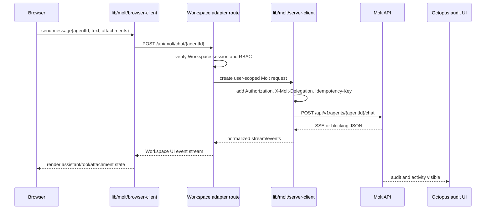
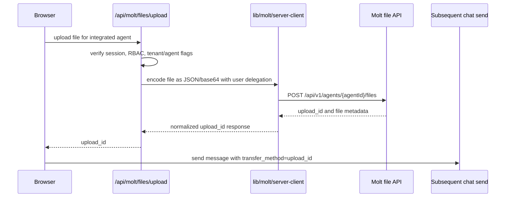

# Molt Integration ADR

Date: 2026-05-03

Status: Accepted for Workspace implementation behind disabled-by-default feature flags.

Related plan:

- `docs/plans/PLAN.md`
- `docs/plans/MOLT-CONTRACT-MATRIX.md`

## Context

Workspace is the tenant-facing product surface. Molt is the supervised agent runtime and operator-visible system of record. Before this integration, Workspace can call DIFY/RAGFlow directly and store local chat state, which lets tenant activity bypass Molt audit and Octopus operator visibility.

The integration target is not a UI rewrite. Workspace keeps the Next.js user experience, login/session handling, company branding, user and department RBAC, knowledge surfaces, and existing tenant workflows. Runtime chat, integrated conversations, attachment custody, authority state, and audit visibility move behind Molt.

## Decisions

1. Workspace is the tenant UI for Molt.
2. Molt is the supervised runtime and system of record for integrated chat, conversations, attachments, audit, and authority.
3. Workspace remains the policy source for user/company/department RBAC. Workspace computes effective agent access and maps that into each Molt call.
4. Provider execution for integrated agents moves behind Molt. Workspace must not call DIFY/RAGFlow directly in the integrated production hot path.
5. Legacy Workspace chat history remains a read-only archive by default and is marked with `source: "legacy_workspace"`. One-shot ETL into Molt is opt-in per tenant.
6. Workspace server calls Molt with a service API key plus `X-Molt-Delegation` once Molt supports the header. Until then, all production feature flags remain off.

## Rejected Targets

- Status quo: leaves tenant activity invisible to Octopus.
- Permanent dual-write: creates two systems of record for conversations and files.
- Tenant-wide Molt key without user context: loses user-level revocation and audit identity.
- Silent production fallback to DIFY/RAGFlow for integrated agents: recreates the supervision gap.

## Chat Send Flow

## Upload Flow

## Boundary Rules

- Workspace RBAC and Molt API-key scoping are layered. Workspace decides which agents a user can invoke; Molt enforces the scope in the received request.
- Workspace adapters recompute effective access on every Molt request. Revocations must affect the next request.
- All mutating Molt POSTs carry an `Idempotency-Key`.
- Integrated uploads use Molt `upload_id` values. DIFY `local_file`, `remote_url`, `workspace_path`, and direct RAGFlow image paths are legacy-only.
- Local `ChatSession` and `ChatMessage` rows are archive/cache data after cutover, not the integrated source of truth.
- Signed Molt file URLs are passed through for integrated messages. Legacy proxy routes remain only for legacy content.

## Feature Flag Policy

The bridge is disabled by default:

- `MOLT_PROXY_ENABLED_CHAT=false`
- `MOLT_PROXY_ENABLED_UPLOAD=false`
- `MOLT_PROXY_ENABLED_HISTORY=false`

Production enablement also requires tenant and agent allowlists. The contract matrix currently blocks production cutover on `MOLT-PREQ-001` because Molt does not yet verify `X-Molt-Delegation`.

## Consequences

Workspace can implement its server-side bridge, client library, and UI transport behind flags immediately. Production traffic must not be moved until Molt accepts signed Workspace delegation and stamps audit records with Workspace `companyId`, `userId`, `agentId`, and `jti`.
