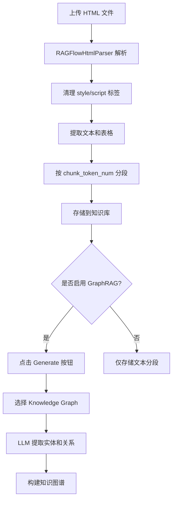

让我查看一下 RAGFlow 对 HTML 网页的处理方式和分段配置：

根据代码分析，我来详细说明 **HTML 网页的知识库配置和知识图谱提取方案**：

---

## 📋 HTML 网页知识库配置方案

### 1️⃣ **支持 HTML 的分段方法（Chunk Method）**

RAGFlow 中支持 HTML 文件的分段方法有 **2 种**：

| 分段方法 | 是否支持 HTML | 特点 | 推荐场景 |
|---------|--------------|------|---------|
| **Naive** ✅ | ✅ 支持 | 智能分段，基于 token 数量和分隔符 | **推荐用于网页** |
| **Book** ✅ | ✅ 支持 | 按章节结构分段 | 适合长篇网页文档 |

---

### 2️⃣ **推荐配置：Naive 方法**

#### **为什么选择 Naive？**

1. **专门的 HTML 解析器**：使用 `RAGFlowHtmlParser`（`deepdoc/parser/html_parser.py`）
2. **智能清理**：自动删除 `<style>`、`<script>`、注释等无用内容
3. **结构化分段**：识别 HTML 标签结构（h1-h6, p, div, table 等）
4. **灵活配置**：可调整 token 数量、分隔符等参数

#### **配置参数**

````python path=rag/app/naive.py mode=EXCERPT
parser_config = {
    "chunk_token_num": 512,        # 每个分段的 token 数量
    "delimiter": "\n!?。；！？",    # 分隔符
    "layout_recognize": "DeepDOC", # 布局识别方法
    "analyze_hyperlink": True      # 是否分析超链接
}
````

---

### 3️⃣ **HTML 解析器工作原理**

````python path=deepdoc/parser/html_parser.py mode=EXCERPT
class RAGFlowHtmlParser:
    def __call__(self, fnm, binary=None, chunk_token_num=512):
        # 1. 解析 HTML
        soup = BeautifulSoup(txt, "html5lib")
        
        # 2. 清理无用标签
        for style_tag in soup.find_all(["style", "script"]):
            style_tag.decompose()
        
        # 3. 递归提取文本
        cls.read_text_recursively(soup.body, temp_sections, chunk_token_num)
        
        # 4. 合并和分段
        sections = cls.chunk_block(block_txt_list, chunk_token_num)
````

**识别的 HTML 标签**：
- **标题**：h1, h2, h3, h4, h5, h6
- **段落**：p, div, article, section, aside
- **列表**：ul, ol, li
- **表格**：table
- **代码**：pre, code, blockquote
- **图片**：figure, figcaption

---

### 4️⃣ **知识图谱提取配置**

#### **完整配置示例（通过 API）**

```json
{
  "name": "网页知识库",
  "chunk_method": "naive",
  "parser_config": {
    "chunk_token_num": 512,
    "delimiter": "\n!?。；！？",
    "layout_recognize": "DeepDOC",
    "analyze_hyperlink": true,
    "graphrag": {
      "use_graphrag": true,
      "entity_types": ["组织", "人员", "地理位置", "事件", "类别"],
      "method": "light",
      "resolution": true,
      "community": true
    }
  }
}
```

#### **GraphRAG 参数说明**

| 参数 | 类型 | 默认值 | 说明 |
|------|------|--------|------|
| `use_graphrag` | boolean | `false` | 是否启用知识图谱提取 |
| `entity_types` | array | `["组织", "人员", ...]` | 要提取的实体类型 |
| `method` | string | `"light"` | 提取方法：`light` 或 `general` |
| `resolution` | boolean | `false` | 是否进行实体消歧 |
| `community` | boolean | `false` | 是否进行社区检测 |

---

### 5️⃣ **超链接分析功能**

Naive 方法支持 **自动爬取和分析网页中的超链接**：

````python path=rag/app/naive.py mode=EXCERPT
if parser_config.get("analyze_hyperlink", False):
    # 从 DOCX 或 Markdown 中提取链接
    urls = extract_links_from_docx(binary)
    
    # 递归爬取每个链接的 HTML 内容
    for url in urls:
        html_bytes, metadata = extract_html(url)
        sub_url_res = chunk(url, html_bytes, ...)
        url_res.extend(sub_url_res)
````

**配置**：
```json
{
  "analyze_hyperlink": true  // 启用超链接分析
}
```

---

### 6️⃣ **完整工作流程**



---

## 🎯 **推荐配置总结**

### **方案 1：基础网页知识库（无知识图谱）**

```json
{
  "chunk_method": "naive",
  "parser_config": {
    "chunk_token_num": 512,
    "delimiter": "\n!?。；！？",
    "layout_recognize": "DeepDOC"
  }
}
```

### **方案 2：网页知识库 + 知识图谱（推荐）**

```json
{
  "chunk_method": "naive",
  "parser_config": {
    "chunk_token_num": 512,
    "delimiter": "\n!?。；！？",
    "layout_recognize": "DeepDOC",
    "analyze_hyperlink": true,
    "graphrag": {
      "use_graphrag": true,
      "entity_types": ["组织", "人员", "地理位置", "事件", "类别"],
      "method": "light",
      "resolution": true,
      "community": true
    }
  }
}
```

### **方案 3：长篇网页文档（类似电子书）**

```json
{
  "chunk_method": "book",
  "parser_config": {
    "chunk_token_num": 512,
    "delimiter": "\n!?。；！？",
    "graphrag": {
      "use_graphrag": true,
      "entity_types": ["组织", "人员", "地理位置", "事件", "类别"],
      "method": "general"
    }
  }
}
```

---

## 📝 **操作步骤**

### **通过 UI 配置**

1. 创建知识库时选择 **Naive** 分段方法
2. 配置参数：
   - **Max Token Number**：512（默认）
   - **Delimiter**：`\n!?。；！？`
3. 在 **GraphRAG** 部分：
   - 勾选 **Enable GraphRAG**
   - 设置实体类型：`组织, 人员, 地理位置, 事件, 类别`
   - 选择方法：**Light**（推荐）或 **General**
4. 上传 HTML 文件
5. 等待文件解析完成
6. 点击 **Generate** 按钮 → 选择 **Knowledge Graph**

### **通过 API 配置**

```bash
curl -X POST "http://localhost:8080/api/v1/kb" \
  -H "Authorization: Bearer YOUR_TOKEN" \
  -H "Content-Type: application/json" \
  -d '{
    "name": "网页知识库",
    "chunk_method": "naive",
    "parser_config": {
      "chunk_token_num": 512,
      "delimiter": "\n!?。；！？",
      "layout_recognize": "DeepDOC",
      "graphrag": {
        "use_graphrag": true,
        "entity_types": ["组织", "人员", "地理位置", "事件", "类别"],
        "method": "light"
      }
    }
  }'
```

---

## ⚠️ **注意事项**

1. **HTML 文件编码**：确保 HTML 文件是 UTF-8 编码
2. **文件大小**：大型网页建议使用 `book` 方法
3. **超链接爬取**：启用 `analyze_hyperlink` 会增加处理时间
4. **知识图谱生成**：需要手动触发，不是自动的
5. **LLM 成本**：知识图谱提取会消耗大量 LLM tokens
