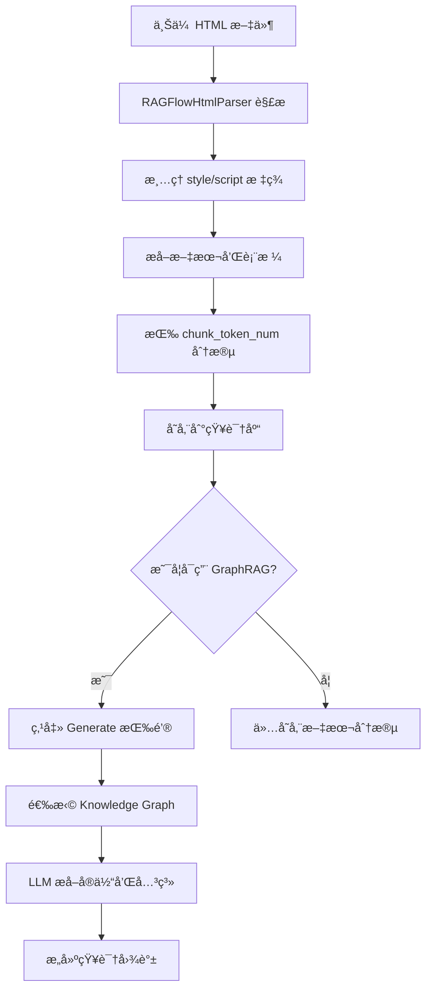

让我查看一下 RAGFlow 对 HTML 网页的处ç†æ–¹å¼å’Œåˆ†æ®µé…置：

æ ¹æ®ä»£ç åˆ†æ，我æ¥è¯¦ç»†è¯´æ˜ **HTML 网页的知识库é…置和知识图谱æå–方案**：

---

## 📋 HTML 网页知识库é…置方案

### 1ï¸âƒ£ **æ”¯æŒ HTML 的分段方法（Chunk Method）**

RAGFlow ä¸­æ”¯æŒ HTML 文件的分段方法有 **2 ç§**：

| 分段方法 | 是å¦æ”¯æŒ HTML | 特点 | æ¨è场景 |
|---------|--------------|------|---------|
| **Naive** ✅ | ✅ æ”¯æŒ | æ™ºèƒ½åˆ†æ®µï¼ŒåŸºäº token æ•°é‡å’Œåˆ†éš”符 | **æ¨è用äºç½‘页** |
| **Book** ✅ | ✅ æ”¯æŒ | 按章节结æ„分段 | 适åˆé•¿ç¯‡ç½‘页文档 |

---

### 2ï¸âƒ£ **æ¨èé…置：Naive 方法**

#### **为什么选择 Naive？**

1. **专门的 HTML 解æ器**：使用 `RAGFlowHtmlParser`（`deepdoc/parser/html_parser.py`）
2. **智能清ç†**：自动删除 `<style>`ã€`<script>`ã€æ³¨é‡Šç­‰æ— ç”¨å†…容
3. **结æ„化分段**：识别 HTML 标签结æ„（h1-h6, p, div, table 等）
4. **çµæ´»é…ç½®**：å¯è°ƒæ•´ token æ•°é‡ã€åˆ†éš”符等å‚æ•°

#### **é…ç½®å‚æ•°**

````python path=rag/app/naive.py mode=EXCERPT
parser_config = {
    "chunk_token_num": 512,        # æ¯ä¸ªåˆ†æ®µçš„ token æ•°é‡
    "delimiter": "\n!?。；ï¼ï¼Ÿ",    # 分隔符
    "layout_recognize": "DeepDOC", # 布局识别方法
    "analyze_hyperlink": True      # 是å¦åˆ†æ超链æ¥
}
````

---

### 3ï¸âƒ£ **HTML 解æ器工作åŸç†**

````python path=deepdoc/parser/html_parser.py mode=EXCERPT
class RAGFlowHtmlParser:
    def __call__(self, fnm, binary=None, chunk_token_num=512):
        # 1. 解æ HTML
        soup = BeautifulSoup(txt, "html5lib")
        
        # 2. 清ç†æ— ç”¨æ ‡ç­¾
        for style_tag in soup.find_all(["style", "script"]):
            style_tag.decompose()
        
        # 3. 递归æå–文本
        cls.read_text_recursively(soup.body, temp_sections, chunk_token_num)
        
        # 4. åˆå¹¶å’Œåˆ†æ®µ
        sections = cls.chunk_block(block_txt_list, chunk_token_num)
````

**识别的 HTML 标签**：
- **标题**：h1, h2, h3, h4, h5, h6
- **段è½**：p, div, article, section, aside
- **列表**：ul, ol, li
- **表格**：table
- **代ç **：pre, code, blockquote
- **图片**：figure, figcaption

---

### 4ï¸âƒ£ **知识图谱æå–é…ç½®**

#### **完整é…置示例（通过 API）**

```json
{
  "name": "网页知识库",
  "chunk_method": "naive",
  "parser_config": {
    "chunk_token_num": 512,
    "delimiter": "\n!?。；ï¼ï¼Ÿ",
    "layout_recognize": "DeepDOC",
    "analyze_hyperlink": true,
    "graphrag": {
      "use_graphrag": true,
      "entity_types": ["组织", "人员", "地ç†ä½ç½®", "事件", "类别"],
      "method": "light",
      "resolution": true,
      "community": true
    }
  }
}
```

#### **GraphRAG å‚数说æ˜**

| å‚æ•° | ç±»å‹ | 默认值 | è¯´æ˜ |
|------|------|--------|------|
| `use_graphrag` | boolean | `false` | 是å¦å¯ç”¨çŸ¥è¯†å›¾è°±æå– |
| `entity_types` | array | `["组织", "人员", ...]` | è¦æå–çš„å®ä½“ç±»å‹ |
| `method` | string | `"light"` | æå–方法：`light` 或 `general` |
| `resolution` | boolean | `false` | 是å¦è¿›è¡Œå®ä½“消歧 |
| `community` | boolean | `false` | 是å¦è¿›è¡Œç¤¾åŒºæ£€æµ‹ |

---

### 5ï¸âƒ£ **超链æ¥åˆ†æ功能**

Naive æ–¹æ³•æ”¯æŒ **自动爬å–和分æ网页中的超链æ¥**：

````python path=rag/app/naive.py mode=EXCERPT
if parser_config.get("analyze_hyperlink", False):
    # ä» DOCX 或 Markdown 中æå–链æ¥
    urls = extract_links_from_docx(binary)
    
    # 递归爬å–æ¯ä¸ªé“¾æ¥çš„ HTML 内容
    for url in urls:
        html_bytes, metadata = extract_html(url)
        sub_url_res = chunk(url, html_bytes, ...)
        url_res.extend(sub_url_res)
````

**é…ç½®**：
```json
{
  "analyze_hyperlink": true  // å¯ç”¨è¶…链æ¥åˆ†æ
}
```

---

### 6ï¸âƒ£ **完整工作æµç¨‹**



---

## 🯠**æ¨èé…置总结**

### **方案 1：基础网页知识库（无知识图谱）**

```json
{
  "chunk_method": "naive",
  "parser_config": {
    "chunk_token_num": 512,
    "delimiter": "\n!?。；ï¼ï¼Ÿ",
    "layout_recognize": "DeepDOC"
  }
}
```

### **方案 2：网页知识库 + 知识图谱（æ¨è）**

```json
{
  "chunk_method": "naive",
  "parser_config": {
    "chunk_token_num": 512,
    "delimiter": "\n!?。；ï¼ï¼Ÿ",
    "layout_recognize": "DeepDOC",
    "analyze_hyperlink": true,
    "graphrag": {
      "use_graphrag": true,
      "entity_types": ["组织", "人员", "地ç†ä½ç½®", "事件", "类别"],
      "method": "light",
      "resolution": true,
      "community": true
    }
  }
}
```

### **方案 3：长篇网页文档（类似电å­ä¹¦ï¼‰**

```json
{
  "chunk_method": "book",
  "parser_config": {
    "chunk_token_num": 512,
    "delimiter": "\n!?。；ï¼ï¼Ÿ",
    "graphrag": {
      "use_graphrag": true,
      "entity_types": ["组织", "人员", "地ç†ä½ç½®", "事件", "类别"],
      "method": "general"
    }
  }
}
```

---

## 📠**æ“作步骤**

### **通过 UI é…ç½®**

1. 创建知识库时选择 **Naive** 分段方法
2. é…ç½®å‚数：
   - **Max Token Number**：512（默认）
   - **Delimiter**：`\n!?。；ï¼ï¼Ÿ`
3. 在 **GraphRAG** 部分：
   - 勾选 **Enable GraphRAG**
   - 设置å®ä½“ç±»å‹ï¼š`组织, 人员, 地ç†ä½ç½®, 事件, 类别`
   - 选择方法：**Light**（æ¨è）或 **General**
4. 上传 HTML 文件
5. 等待文件解æ完æˆ
6. 点击 **Generate** 按钮 → 选择 **Knowledge Graph**

### **通过 API é…ç½®**

```bash
curl -X POST "http://localhost:8080/api/v1/kb" \
  -H "Authorization: Bearer YOUR_TOKEN" \
  -H "Content-Type: application/json" \
  -d '{
    "name": "网页知识库",
    "chunk_method": "naive",
    "parser_config": {
      "chunk_token_num": 512,
      "delimiter": "\n!?。；ï¼ï¼Ÿ",
      "layout_recognize": "DeepDOC",
      "graphrag": {
        "use_graphrag": true,
        "entity_types": ["组织", "人员", "地ç†ä½ç½®", "事件", "类别"],
        "method": "light"
      }
    }
  }'
```

---

## âš ï¸ **注æ„事项**

1. **HTML 文件编ç **ï¼šç¡®ä¿ HTML 文件是 UTF-8 ç¼–ç 
2. **文件大å°**：大å‹ç½‘页建议使用 `book` 方法
3. **超链æ¥çˆ¬å–**：å¯ç”¨ `analyze_hyperlink` 会å¢åŠ å¤„ç†æ—¶é—´
4. **知识图谱生æˆ**：需è¦æ‰‹åŠ¨è§¦å‘，ä¸æ˜¯è‡ªåŠ¨çš„
5. **LLM æˆæœ¬**：知识图谱æå–ä¼šæ¶ˆè€—å¤§é‡ LLM tokens
