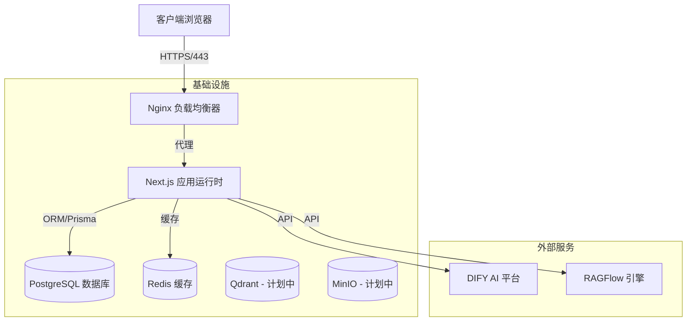

# SGA Workspace - 项目设计文档

## 1. 项目概述
**SGA Workspace** 是一个企业级 AI 智能体管理平台，旨在支持组织在统一的环境中部署、管理和与多个 AI 智能体进行交互。它作为一个中心枢纽，连接员工与各种 AI 能力，具备多租户支持、基于角色的访问控制（RBAC），并与 DIFY 和 RAGFlow 等 AI 平台无缝集成。

## 2. 系统架构

该项目采用现代微服务启发式架构，主要通过 Docker 进行容器化部署。



### 核心组件
- **客户端**: 基于 Next.js 和 Tailwind CSS 构建的响应式 Web 界面。
- **Nginx**: 作为反向代理和入口点，处理 SSL 加密和路由。
- **Next.js 应用**: 核心应用逻辑，同时提供前端 UI 和后端 API 路由。
- **PostgreSQL**: 主关系型数据库，存储用户、企业和代理配置数据。
- **Redis**: 用于会话缓存和潜在的速率限制。
- **AI 集成**: 连接外部 AI 引擎（如 DIFY 和 RAGFlow）以提供核心智能能力。

## 3. 技术栈

### 前端
- **框架**: Next.js 14.2.5 (App Router)
- **语言**: TypeScript
- **样式**: Tailwind CSS, Sass
- **UI 组件**: Radix UI, Lucide React
- **状态管理**: Zustand
- **本地存储**: IndexedDB (通过 `idb-keyval`) 实现离线优先功能
- **可视化**: Reactflow, Recharts, D3.js

### 后端
- **运行时**: Node.js (通过 Next.js)
- **数据库 ORM**: Prisma
- **认证**: Supabase Auth (集成) / 自定义 JWT 实现
- **验证**: Zod
- **API 客户端**: Axios

### 基础设施
- **容器化**: Docker & Docker Compose
- **数据库**: PostgreSQL
- **缓存**: Redis
- **Web 服务器**: Nginx

## 4. 数据模型 (核心 Schema)

系统通过以下核心模型处理多租户和 AI 智能体管理：

### 组织与用户管理
- **Company (企业)**: 顶层租户。包含 `name` (名称), `logoUrl` (Logo链接), 以及与部门和用户的关联。
- **Department (部门)**: 企业内的组织单元。
- **User (用户)**: 最终用户实体。关联到企业，可选关联到部门。通过基于角色的访问控制 (`ADMIN`, `USER`) 进行管理。

### AI 与 聊天
- **Agent (智能体)**: 代表 AI 助手。
  - 属性: `platform` (DIFY, RAGFLOW 等), `difyUrl`, `difyKey`, `isOnline`。
  - 作用域: `Company` 和 `Department`。
- **ChatSession (聊天会话)**: `User` 和 `Agent` 之间的对话实例。
- **ChatMessage (聊天消息)**: 会话中的单条消息。
- **UploadedFile (上传文件)**: 用户上传的用于上下文或处理的文件。

### 知识管理
- **KnowledgeGraph (知识图谱)**: 代表已连接的知识库。
  - 关联到 `Company`。
  - 属性: `ragflowUrl`, `nodeCount` (节点数), `edgeCount` (边数)。
  - 通过 `UserKnowledgeGraphPermission` 控制权限。

## 5. 关键功能

1.  **多租户架构**:
    - 通过 `company_id` 实现通过数据隔离。
    - 每个组织拥有独立的品牌和用户管理。

2.  **AI 智能体编排**:
    - 统一的界面与底层不同的 AI 模型（DIFY, RAGFlow, OpenAI）进行对话。
    - 智能体状态监控（在线/离线检查）。

3.  **实时聊天**:
    - 支持 Markdown 和附件的富文本界面。
    - 历史记录持久化和检索。

4.  **安全与访问控制**:
    - 细粒度权限：`UserAgentPermission` 和 `UserKnowledgeGraphPermission` 控制谁可以访问哪些资源。
    - 基于角色的可见性（管理员 vs 普通用户）。

5.  **离线能力**:
    - 在浏览器中大量使用 `IndexedDB` 缓存聊天记录，提供类似渐进式 Web 应用 (PWA) 的功能。

## 6. 知识图谱可视化

### 6.1 功能概述
为临时知识库提供知识图谱可视化功能，将 RAGFlow 返回的实体和关系数据以交互式力导向图形式展示。

### 6.2 数据结构
```typescript
interface GraphData {
  nodes: Array<{
    id: string
    entity_name: string      // 实体名称
    entity_type: string      // 实体类型: organization, person, geo, event, category
    description?: string     // 描述
    pagerank?: number        // PageRank 值（重要性）
  }>
  edges: Array<{
    source: string          // 源节点 ID
    target: string          // 目标节点 ID
    description?: string    // 关系描述
    weight?: number         // 权重
  }>
}
```

### 6.3 技术选型
| 方案 | 优点 | 缺点 | 选择 |
|------|------|------|------|
| D3.js Force Graph | 已安装、高度定制化、力导向布局自然 | 需要手动实现交互 | ✅ 采用 |
| ReactFlow | 已安装、组件化 | 更适合流程图，节点布局不自然 | - |
| react-force-graph | 专门用于力导向图 | 需要额外安装 | - |

### 6.4 可视化设计

#### 节点样式
| 实体类型 | 颜色 | 说明 |
|----------|------|------|
| person | #3B82F6 (蓝色) | 人物 |
| organization | #10B981 (绿色) | 组织/机构 |
| geo | #F59E0B (橙色) | 地理位置 |
| event | #8B5CF6 (紫色) | 事件 |
| category | #EC4899 (粉色) | 分类 |
| 默认 | #6B7280 (灰色) | 其他类型 |

#### 节点大小
- 根据 `pagerank` 值动态计算（范围 20-50px）
- 重要性越高，节点越大

#### 交互功能
1. **拖拽节点**: 拖动调整布局
2. **缩放/平移**: 鼠标滚轮缩放，拖拽画布平移
3. **悬停提示**: 显示实体名称、类型、描述
4. **边悬停**: 显示关系描述

### 6.5 组件结构
```
components/temp-kb/
├── knowledge-graph-view.tsx    # 图谱可视化组件（D3 力导向图）
├── temp-kb-panel.tsx           # 集成图谱展示
├── saved-chunks-list.tsx       # 知识片段列表
└── temp-kb-dialog.tsx          # 知识库对话框
```

### 6.6 API 接口
```
GET  /api/temp-kb/graph         # 获取知识图谱数据
POST /api/temp-kb/graph         # 触发图谱构建
GET  /api/temp-kb/graph/status  # 查询构建状态
```

## 7. 部署

项目设计为 "Docker 优先" 部署：
- **生产环境**: 使用 `docker-compose.prod.yml` 编排 Nginx, App, Postgres, 和 Redis。
- **中国区优化**: 通过 `docker-compose.china.yml` 进行特定优化。
- **脚本**: 提供 `quick-deploy.sh` 和 `quick-deploy.bat` 实现一键安装。
