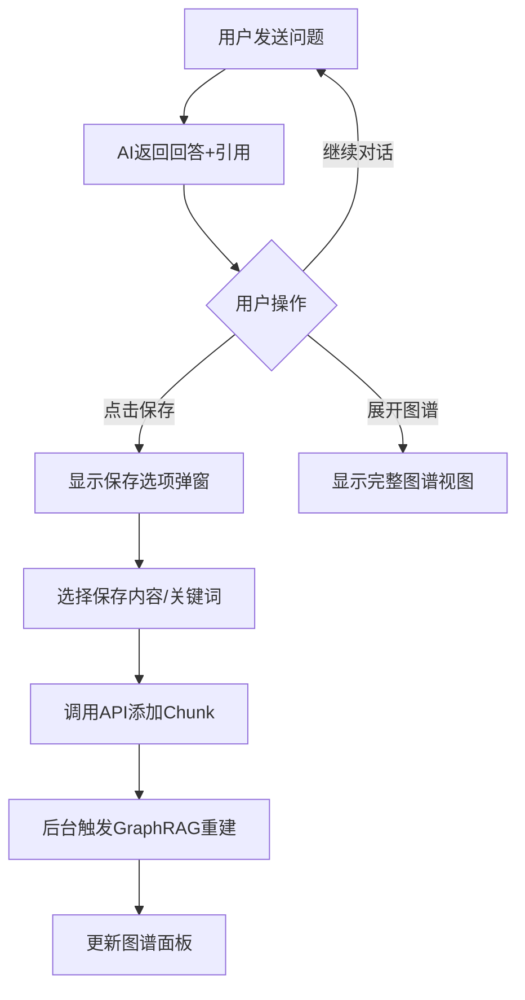
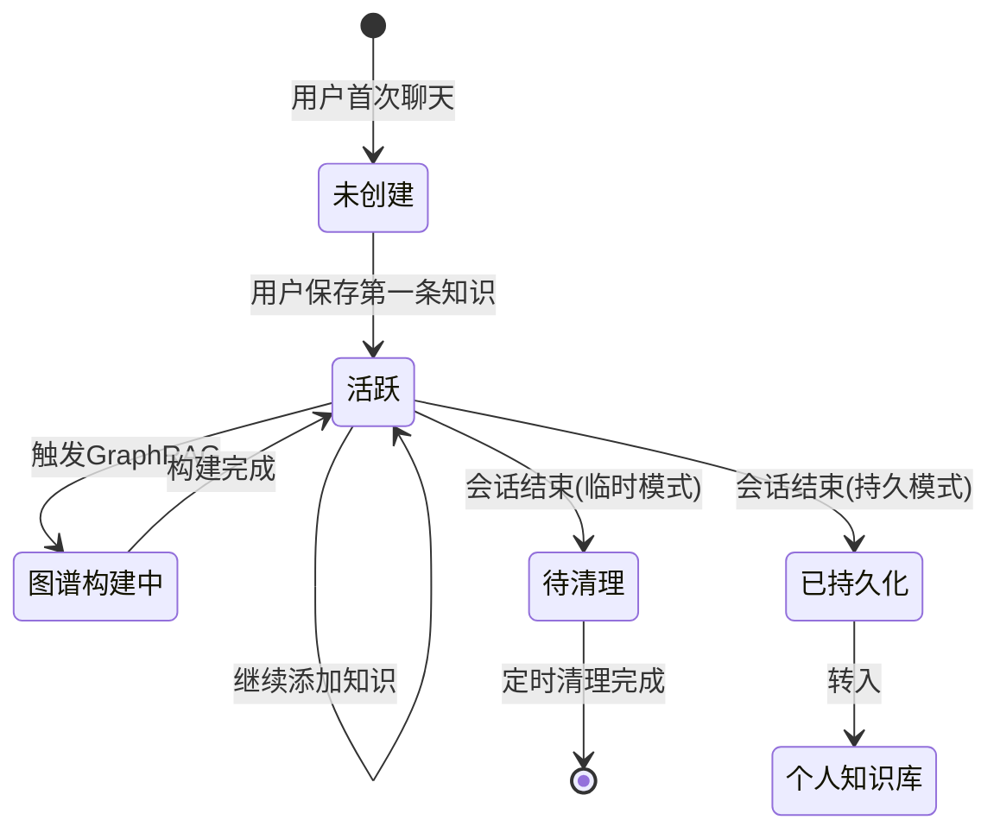

# 临时知识图谱功能设计文档

**创建日期**: 2024-12-25  
**状态**: 📋 设计阶段  
**版本**: v1.0

---

## 📋 功能概述

### 核心定位
在用户与AI智能体对话过程中，允许用户**选择性保存有价值的知识片段**到临时知识库，并实时构建个人知识图谱。管理员可配置是否允许用户持久化这些知识。

### 用户价值
- 📝 **知识沉淀** - 对话中有价值的信息不再丢失
- 🔗 **关联发现** - 通过图谱发现知识间的隐藏关系  
- 🎯 **个性化** - 每个用户拥有独立的知识空间

---

## 🏗️ 技术架构

### 数据流向

```
用户聊天 → 选择保存内容 → 调用RAGFlow API添加Chunk
                              ↓
                    触发GraphRAG重建 → 更新图谱展示
                              ↓
        聊天结束 → 检查持久化配置 → 清理或保留知识库
```

### RAGFlow API 调用序列

| 步骤 | API | 用途 |
|------|-----|------|
| 1 | `POST /api/v1/datasets` | 为用户创建临时知识库 |
| 2 | `POST /api/v1/datasets/{id}/documents/{docId}/chunks` | 添加用户选择的知识片段 |
| 3 | `POST /api/v1/datasets/{id}/run_graphrag` | 重建知识图谱 |
| 4 | `GET /api/v1/datasets/{id}/knowledge_graph` | 获取图谱数据展示 |
| 5 | `DELETE /api/v1/datasets` | 清理临时知识库(非持久化模式) |

---

## 🎨 用户界面设计

### 入口位置：聊天界面

选择在**聊天界面**而非知识图谱界面添加入口，原因：
1. ✅ 上下文连贯 - 知识来源于对话，就地保存最自然
2. ✅ 即时反馈 - 用户实时看到知识积累效果
3. ✅ 降低门槛 - 无需跳转页面，流程更顺畅

### 界面布局

```
┌─────────────────────────────────────────────────────────────────┐
│  会话列表   │        聊天主区域           │  知识图谱面板(折叠) │
│  (已有)     │                             │                     │
│            │  💬 用户: 什么是RAG?         │  [展开图谱] 按钮    │
│            │                             │                     │
│            │  🤖 助手: RAG是检索增强...    │  ┌───────────────┐  │
│            │       [💾 保存到知识图谱]    │  │ 迷你图谱预览  │  │
│            │                             │  │ 节点: 5       │  │
│            │  📖 知识库引用               │  │ 关系: 3       │  │
│            │   └─ doc1.pdf (第2页)       │  └───────────────┘  │
│            │                             │                     │
│            │                             │  📋 最近保存:       │
│            │                             │  • RAG概念          │
│            │                             │  • 检索流程         │
└─────────────────────────────────────────────────────────────────┘
```

### 交互流程



---

## 💾 数据模型设计

### Prisma Schema 扩展

```prisma
// 用户临时知识库
model UserTempKnowledgeBase {
  id              String    @id @default(cuid())
  userId          String    @unique @map("user_id")
  ragflowKbId     String    @map("ragflow_kb_id")     // RAGFlow dataset ID
  ragflowDocId    String?   @map("ragflow_doc_id")    // 虚拟文档ID
  sessionId       String?   @map("session_id")        // 关联的聊天会话
  chunkCount      Int       @default(0) @map("chunk_count")
  isPersistent    Boolean   @default(false) @map("is_persistent")
  lastActiveAt    DateTime  @default(now()) @map("last_active_at")
  createdAt       DateTime  @default(now()) @map("created_at")
  expiresAt       DateTime? @map("expires_at")        // 过期时间
  
  user            User      @relation(fields: [userId], references: [id], onDelete: Cascade)
  savedChunks     UserSavedChunk[]
  
  @@map("user_temp_knowledge_bases")
}

// 用户保存的知识片段记录
model UserSavedChunk {
  id              String    @id @default(cuid())
  tempKbId        String    @map("temp_kb_id")
  ragflowChunkId  String    @map("ragflow_chunk_id")  // RAGFlow chunk ID
  content         String    @db.Text                   // 内容摘要
  keywords        String[]                             // 关键词
  sourceMessageId String?   @map("source_message_id") // 来源消息ID
  createdAt       DateTime  @default(now()) @map("created_at")
  
  tempKb          UserTempKnowledgeBase @relation(fields: [tempKbId], references: [id], onDelete: Cascade)
  
  @@map("user_saved_chunks")
}
```

### 系统配置扩展

```prisma
// 在 Company 或全局配置中添加
model SystemConfig {
  id                      String   @id @default(cuid())
  // ... 其他配置
  tempKbPersistentEnabled Boolean  @default(false) @map("temp_kb_persistent_enabled")
  tempKbExpirationHours   Int      @default(24) @map("temp_kb_expiration_hours")
  tempKbMaxChunks         Int      @default(100) @map("temp_kb_max_chunks")
}
```

---

## 🔌 API 设计

### 1. 获取/创建用户临时知识库

```
GET/POST /api/user/temp-kb
```

**响应示例:**
```json
{
  "success": true,
  "data": {
    "id": "cuid_xxx",
    "ragflowKbId": "abc123",
    "chunkCount": 5,
    "isPersistent": false,
    "graphPreview": {
      "nodeCount": 12,
      "edgeCount": 8
    }
  }
}
```

### 2. 保存知识片段

```
POST /api/user/temp-kb/chunks
```

**请求体:**
```json
{
  "content": "RAG是检索增强生成技术...",
  "keywords": ["RAG", "检索", "生成"],
  "sourceMessageId": "msg_123"
}
```

### 3. 获取临时图谱数据

```
GET /api/user/temp-kb/graph
```

### 4. 管理员配置接口

```
PUT /api/admin/config/temp-kb
```

**请求体:**
```json
{
  "persistentEnabled": true,
  "expirationHours": 48,
  "maxChunks": 200
}
```

---

## ⚙️ RAGFlow 配置要求

### GraphRAG 通过 API 参数启用（无需后台UI设置）

创建临时知识库时，在 `parser_config.graphrag` 中配置：

```json
{
  "name": "temp_user_{userId}_{timestamp}",
  "description": "用户临时知识图谱",
  "chunk_method": "naive",
  "parser_config": {
    "chunk_token_num": 512,
    "graphrag": {
      "use_graphrag": true,
      "method": "light",
      "entity_types": ["organization", "person", "geo", "event", "category"],
      "resolution": false,
      "community": false
    }
  }
}
```

### GraphRAG 参数说明

| 参数 | 类型 | 默认值 | 说明 |
|------|------|--------|------|
| `use_graphrag` | boolean | `false` | **必须设为 `true`** 才能启用图谱功能 |
| `method` | string | `"light"` | `"light"` (LightRAG风格，省资源) 或 `"general"` (完整GraphRAG) |
| `entity_types` | array | 见上方 | 要提取的实体类型列表 |
| `resolution` | boolean | `false` | 是否启用实体消歧/去重 |
| `community` | boolean | `false` | 是否生成社区报告 |

> ⚠️ **重要说明**:
> - GraphRAG 是通过 API 参数配置的，**无需在 RAGFlow 后台 UI 手动设置**
> - 只有 `chunk_method: "naive"` 才支持 `graphrag` 配置
> - 创建知识库后需要调用 `/api/v1/datasets/{id}/run_graphrag` 触发图谱构建

---

## 🔄 生命周期管理

### 临时模式 (默认)

```
创建知识库 → 用户添加知识 → 聊天结束 → 等待过期 → 自动清理
                                          ↓
                              定时任务检查过期知识库
```

### 持久模式 (管理员开启)

```
创建知识库 → 用户添加知识 → 聊天结束 → 保留知识库
                                          ↓
                              转为用户个人知识库
                                          ↓
                              可在知识图谱界面查看
```

### 清理策略

| 场景 | 处理方式 |
|------|----------|
| 用户主动退出聊天 | 根据配置决定是否清理 |
| 会话过期 (默认24h) | 定时任务清理 |
| 用户主动删除 | 立即清理 |
| 持久化模式 | 不清理，转入个人知识库 |

---

## 📊 状态流转



---

## 🛠️ 实现计划

### Phase 1: 基础功能 (3天)
- [ ] Prisma 数据模型迁移
- [ ] 临时知识库 CRUD API
- [ ] RAGFlow API 集成封装

### Phase 2: 前端界面 (3天)
- [ ] 聊天消息"保存"按钮
- [ ] 知识图谱侧边面板
- [ ] 保存弹窗组件

### Phase 3: 图谱功能 (2天)
- [ ] 迷你图谱预览组件
- [ ] GraphRAG 重建触发
- [ ] 实时更新机制

### Phase 4: 管理功能 (1天)
- [ ] 管理员配置界面
- [ ] 过期清理定时任务
- [ ] 持久化转换逻辑

---

## 🎯 成功指标

| 指标 | 目标值 |
|------|--------|
| 知识保存响应时间 | < 500ms |
| 图谱重建时间 | < 10s (50个节点内) |
| 用户保存转化率 | > 20% |
| 持久化留存率 | > 50% |

---

## ❓ 待确认问题

1. **图谱重建频率** - 每次保存都重建，还是批量/定时重建？
2. **知识去重** - 如何处理用户保存重复内容？
3. **跨会话共享** - 用户的临时知识库是否跨会话共享？
4. **导出功能** - 是否允许用户导出个人知识图谱？

---

**文档维护者**: AI Assistant
**最后更新**: 2024-12-25

